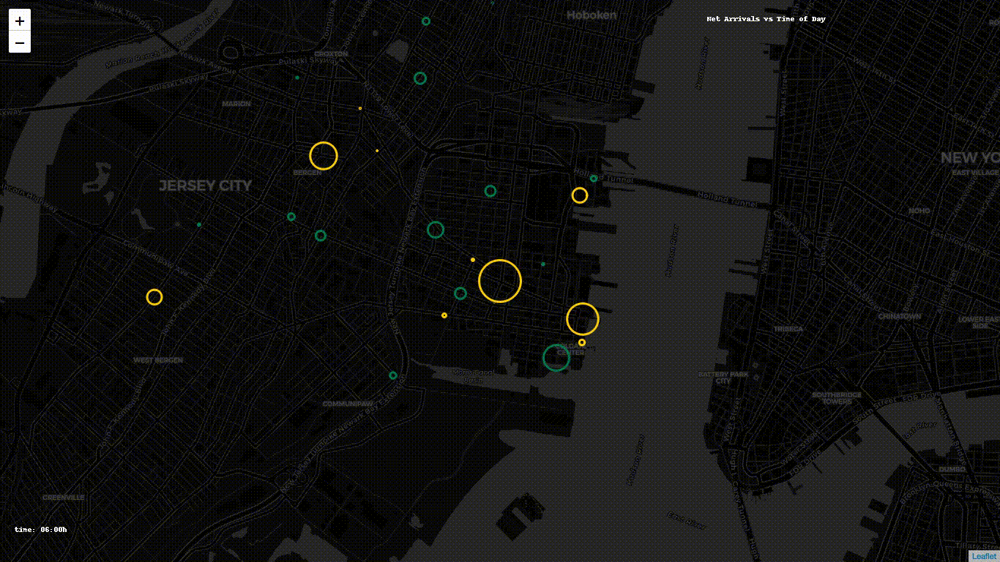

NYC Citi Bike data 
-----------------

This repo contains the jupyter notebook that do EDA and make folium maps for NYC citi bike data (Jan 2016 - June)

1. Data cleaning

  - Prepare dataset
  - Basic Information
  - Distribution of features
  - Segmentation ( categorical - numerical values)
  - Correlation between numerical features
  - Filling missing values

2. Visualization  
  - Subscription users vs Day-pass users Animated maps by time

## pre-requisite:
- `brew install ffmpeg`
- `brew install phantomjs`

## requirements:
- python 3.x
- pandas
- numpy
- folium
- selenium
